# Azure Active Directory (Entra ID) — Identity Lifecycle Lab

This repo documents hands-on practice managing users, roles, and licenses in 
Microsoft Entra ID (Azure Active Directory), completed in my own Azure free-tier 
tenant. The exercises cover core identity lifecycle tasks — user creation, role 
assignment, bulk import, and license administration.

Exercises are structured around common identity lifecycle scenarios (user provisioning, RBAC, bulk operations, licensing) commonly covered in IAM learning paths.

## Technologies Used
- Microsoft Entra ID (Azure Active Directory)
- Microsoft 365 Admin Center
- Microsoft Graph PowerShell
- Microsoft Excel
- Role-Based Access Control (RBAC)
- Identity Lifecycle Management

## What I Practiced
- Managing users and directory roles in Entra ID
- Applying RBAC and the principle of least privilege
- Performing bulk user operations via CSV and PowerShell
- Assigning licenses and verifying usage locations
- Restoring deleted user accounts

---

## Exercise 1 — Creating and Testing a New User

**Task 1: Create a New User**
1. Signed in to the Microsoft Entra admin center as Global Administrator.
2. Navigated to Entra ID → Users → All Users → New user → Create new user.

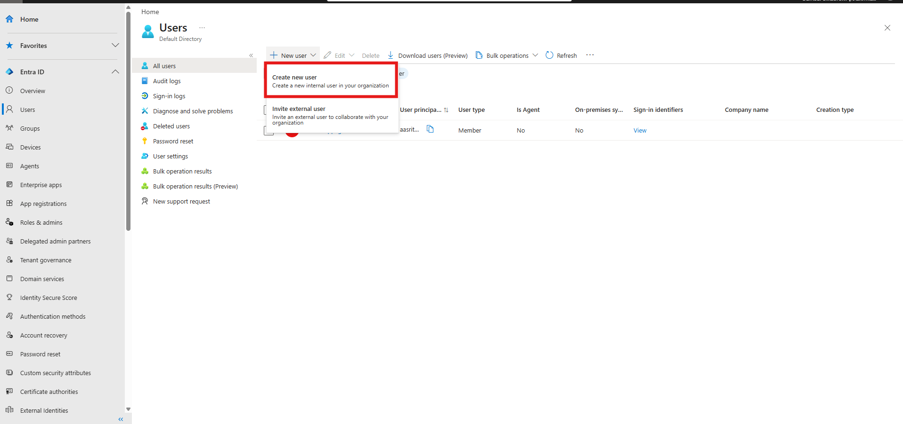
3. Set up the new account:
   - User principal name: `AlexS`
   - Display name: `Alex Smith`
   - Enabled auto-generate password
   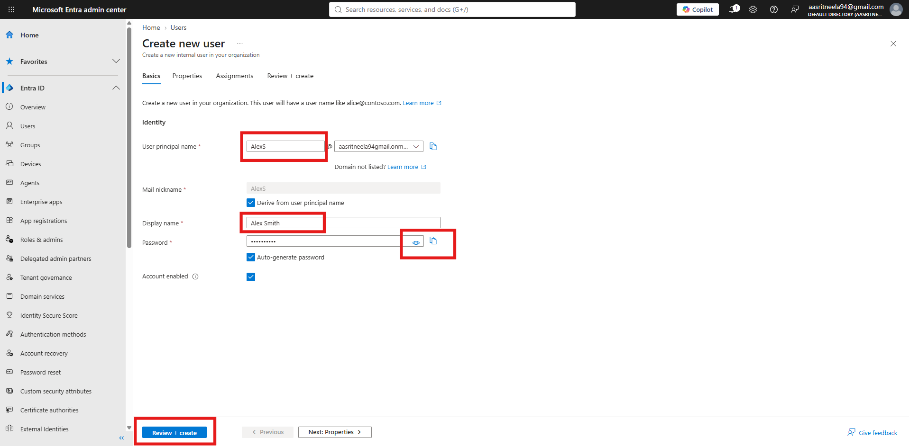
4. Saved the generated password securely for the next step.
5. Reviewed the details and confirmed user creation.
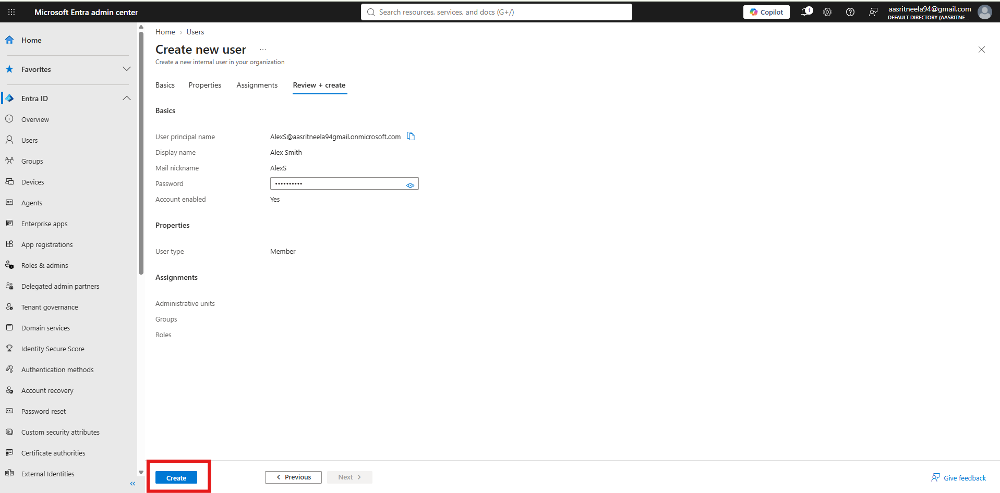
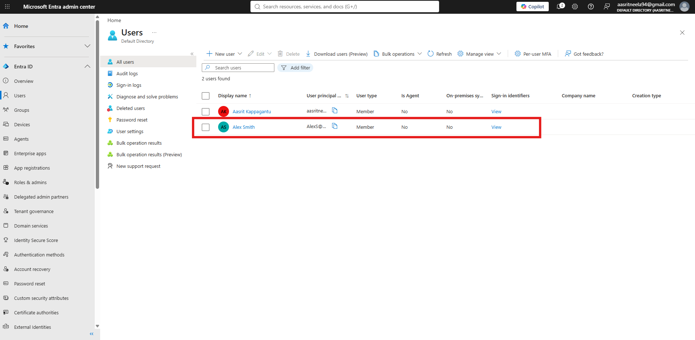

**Task 2: Sign In as the New User and attempt App creation**
1. Opened an incognito browser window and navigated to entra.microsoft.com.
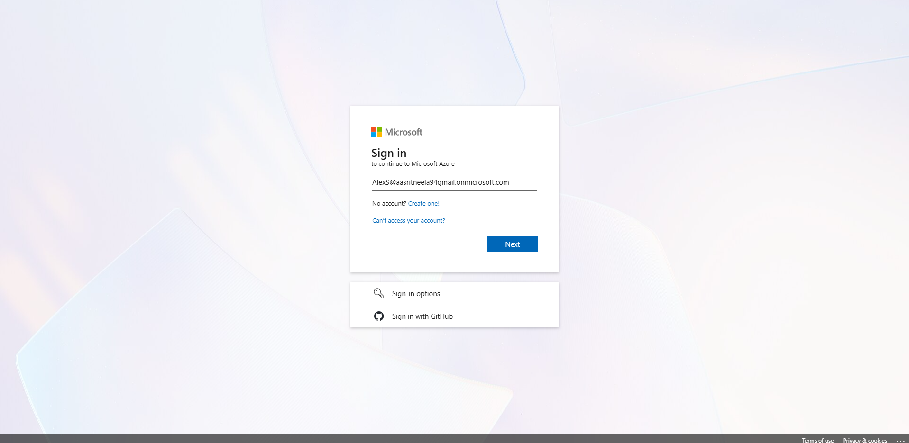
2. Signed in as Alex Smith using the generated credentials.
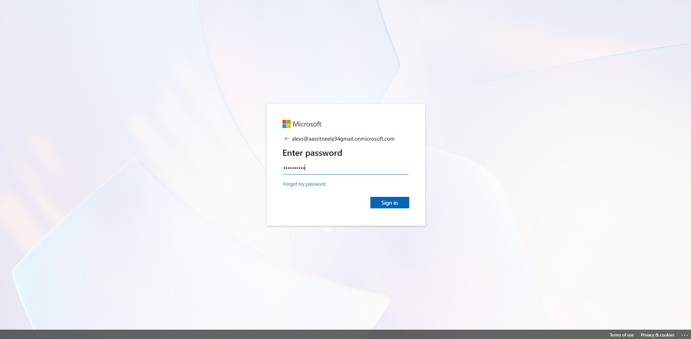
3. Was prompted to set a new password on first login and completed that step.
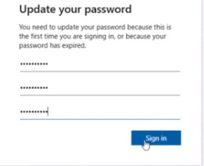
4. Was prompted to set up multi-factor authentication and configured Microsoft Authenticator for the account.
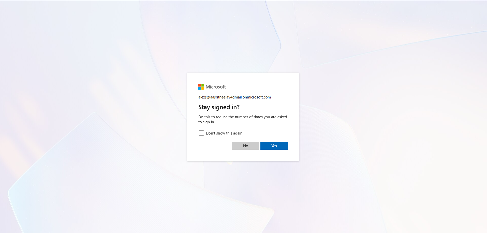
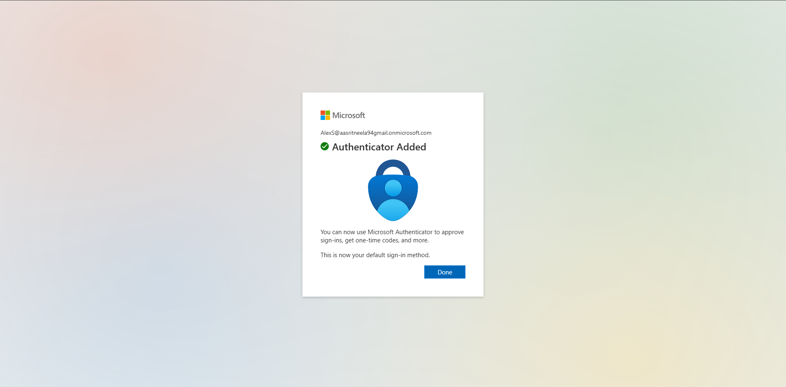
5. Successfully signed in to the account.
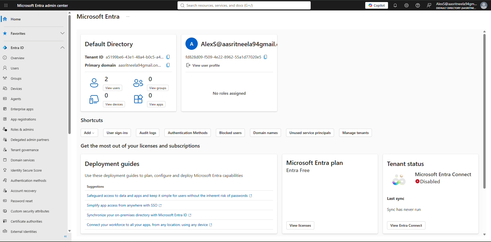
6. Used the search bar to locate Enterprise Applications.
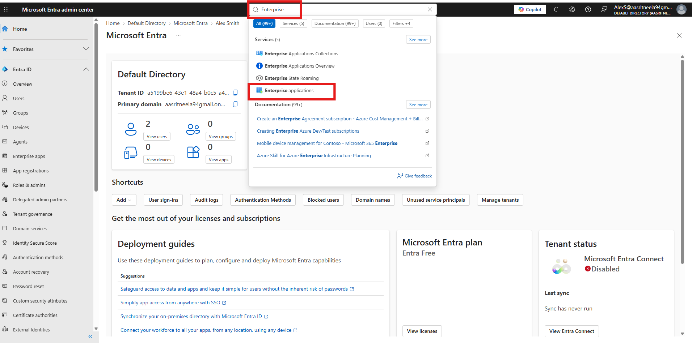
7. Tried to create a new application — confirmed the option was restricted, 
   as expected for a standard (non-admin) user account.
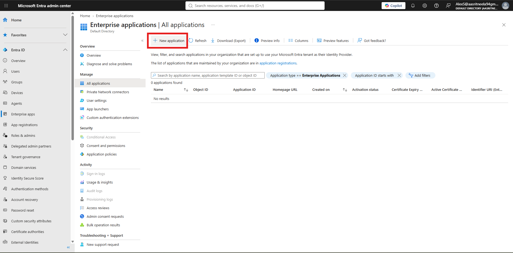
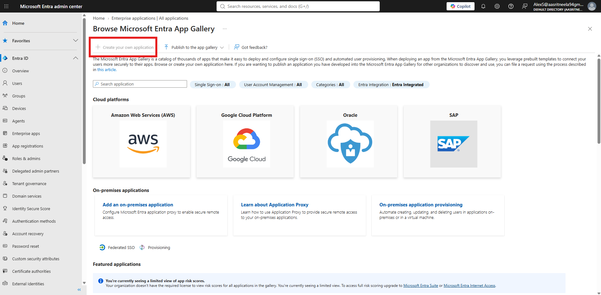
9. Checked the Consent and Permissions settings to verify lack of admin previleges
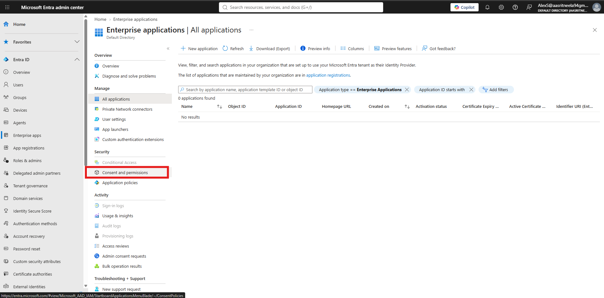
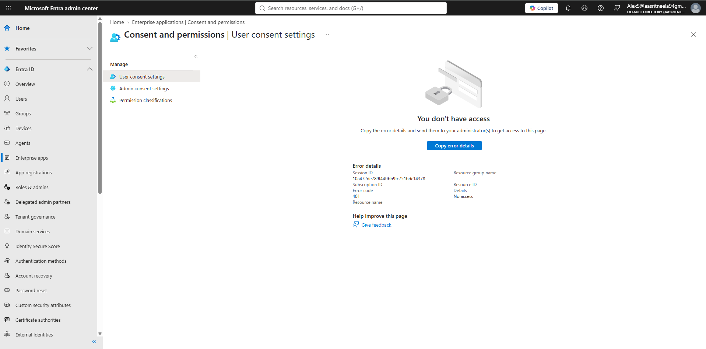
11. Signed out of the Alex Smith session.
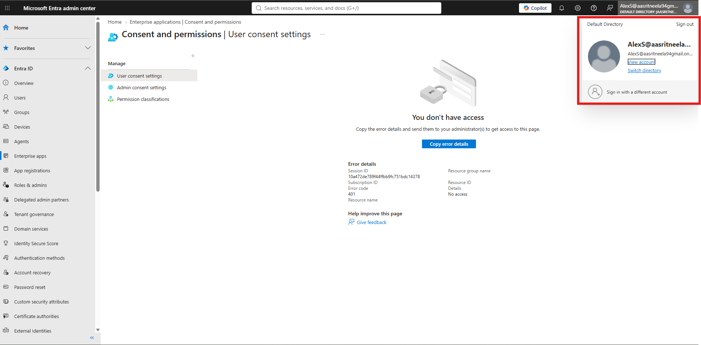
